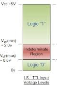
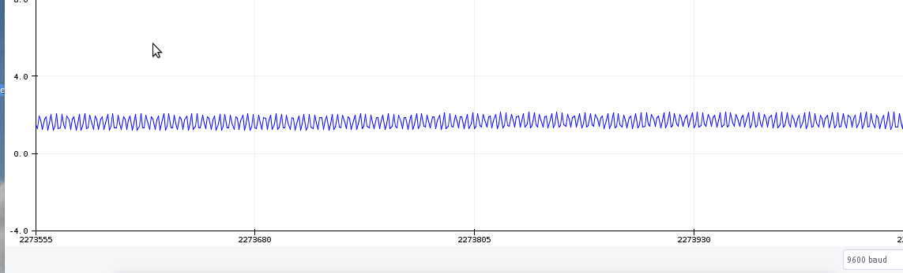

#  Embedded Systems Study Group

- [Basic of Electronics](#basic-of-electronics)
    - [Switch debouncer](#switch-debouncer)
    - [Pull up and Pull Down Resistor](#pull-up-and-pull-down-resistor)
    - [Latches and Flipflops](#flipflops-and-latches)

## Basic of Electronics

- ### Switch Debouncer:
    

        
    

    - Switch Debounce waveform:
    

        
    

    - Hardware solution:
    

        
    

- ### Pull-Up and Pull-Down Resistor:
    - Pull-up and Pull-Down Resistors used in digital systems. 
    - In a digital system, there are three states:
    

        
    

    -  Two obvious states are Logic High and Logic Low. But suppose if we left any pin unconnected/floating then it is said to be tristate or unknown.
    - Example of this in popular 7432 OR gate IC's datasheet:
    

        
    

    
    - Range [2V - 5V]: considered as Logic HIGH.
    - Range [0 - 0.8V]: considered as Logic LOW.
    - Range [0.8 - 2V]: considered as indeterminate state.
    

        
    

    - If we try to measure simple digital input of a micro-controller without any precaution for this unknown state then input signal will look like this:
    

        
    

    
    - But if we connect a pull-up resistor at the input of micro-controller then input signal will look something like this:
    

        
    

- ### FlipFlops and Latches:
    - FlipFlops and Latches are the building blocks of most sequential circuits. FlipFlop is a device that samples it's input and changes only when a clock signal changes. On the other hand latches are sequential devices that watch it's inputs continuously and can change its outputs at any time.
    - ### Latches
        - SR Latch
            - There are 2 types of SR latches depending on the  gates used :-
            
                1) SR Latch ( with NOR gates )
                

                    
                

                2) SR Latch ( with NAND gates )
                

                    
                

     
     - ### FlipFlops
        - SR FlipFlop
            - One extra signal is used here and it is a control     signal like the clock signal.
            

                
            

        - D FlipFlop
            - What if we go into the invalid state by mistake???    The data will be lost and we do not want that.  
            We can see that if we make S and R complements of each other then the invalid state is removed. That is a problem as we can't access the S=0 and R=0 state i.e the memory state. What can you do?  
            Actually this is not a problem as you have clock signal. If you make the clock signal 0 then you automaticaly go into memory state.

            

                
            

    
### Assignment
   - [Assignment 1](../assets/week1/embedded_assignment_1.pdf)
