# Embedded Systems Study Group

- [Embedded Systems Study Group](#embedded-systems-study-group)
  - [PWM](#pwm)
  - [L298N Motor Driver](#l298n-motor-driver)
  - [Proteus Simulation](#proteus-simulation)
  - [ESP32 Block Diagram](#esp32-block-diagram)
  - [Registers in MCU](#registers-in-mcu)
  - [Memory Allocation in C](#memory-allocation-in-c)
    - [Text Segment](#text-segment)
    - [Stack](#stack)
    - [Heap](#heap)
      - [NOTE](#note)
  - [Types of Memory in Embedded Systems](#types-of-memory-in-embedded-systems)
    - [Types Of RAM](#types-of-ram)
    - [Types Of ROM](#types-of-rom)
    - [Types of Hybrid](#types-of-hybrid)
- [Bootloader](#bootloader)
- [Flashing a microcontroller and bootloaders role in it](#flashing-a-microcontroller-and-bootloaders-role-in-it)
- [Assignment](#assignment)

## PWM
- PWM(Pulse Width Modulation) is one of the type of digital signal, which is used in almost every control circuit.
- In PWM, concept of duty cycle is important. Following image shows three different digital signal with different duty cycles:

<p align="center">
    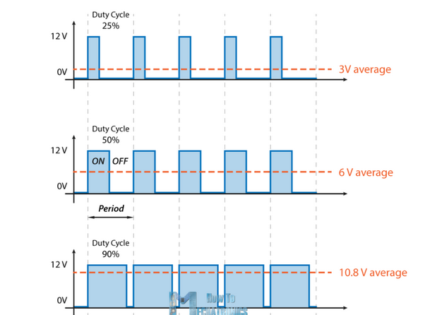
</p>

- As you can see for 50% duty cycle, on time = off time. So **formula of Duty cycle is (Ton/T)\*100 %**
- Application of PWM:
    1. Control Speed of motors
    2. Control dimming of RGB LEDs
    3. Control the position of Servos
- Let's see How PWM is used to control motor direction.

## L298N Motor Driver
- L298N is a transistor based motor driver which having two motor channels.
- Pin Configuration of L298N as follows:

<p align="center">
    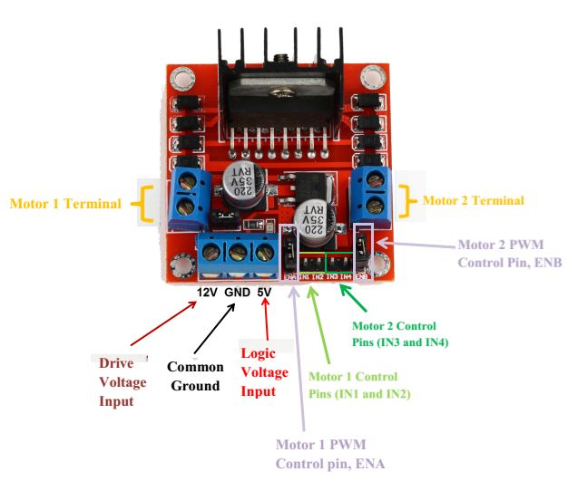
</p>

- Each channel has three control signals to control motor direction and speed which are:
    1. IN1 AND IN2: These are directional pins
    2. PWMA: This pin is used for controlling speed of motor 
- Examples:
1. Forward Motion of motor:
    - IN1: HIGH && IN2: LOW
    - PWMA: Speed will be dependent on this signal, if PWMA is HIGH then motor will move at maximum speed in forward direction. For 50 % duty cycle motors will run at half speed in forward direction.
2. Backword Motion of motor:
    - IN1: LOW && IN2: HIGH
    - PWMA: Speed will be dependent on this signal, if PWMA is HIGH then motor will move at maximum speed in backward direction.

<p align="center">
    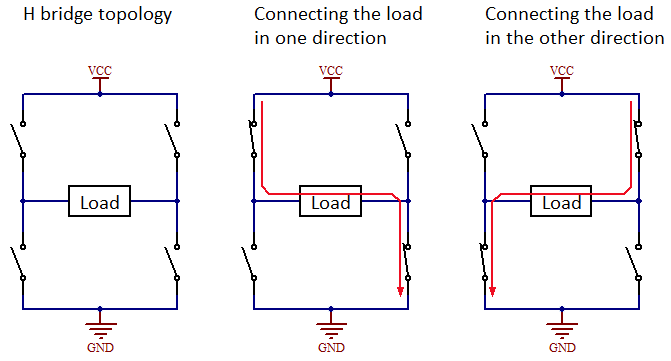
</p>

## Proteus Simulation
- The circuit consists of arduino uno, L298N and three switches for three different duty cycle options
1. SW1: 75% Duty Cycle
2. SW2: 50% Duty Cycle
3. SW3: 25% Duty Cycle
<p align="center">
    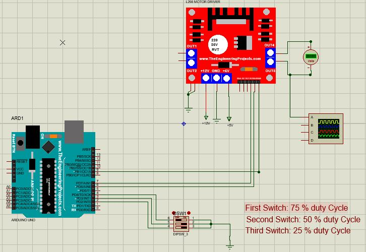
</p>

- 75 % Duty Cycle:
<p align="center">
    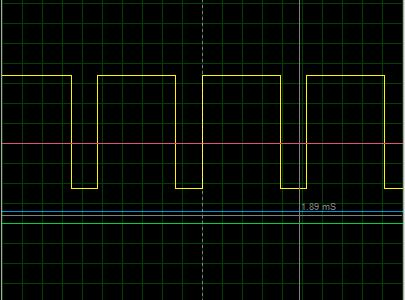
</p>

## ESP32 Block Diagram

<p align="center">
    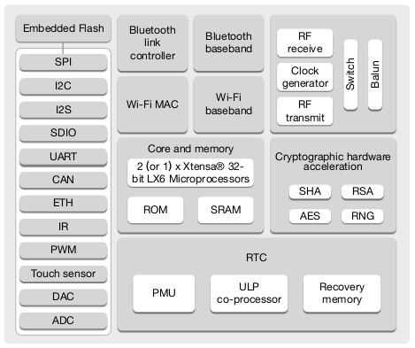
</p>

- As you can see ESP32 block diagram consist of core cpu, memory and other communication protocol units like SPI, I2C, I2S, UART and many other units.

## Registers in MCU

- In every functional units of micro-controller there are different register for different functions. Some registers are simply used for data storage while some used for storing configuration of that particular unit.
- Just for more intuitive idea about these registers let's check out UART unit ofw 8051 micro-controller:

<p align="center">
    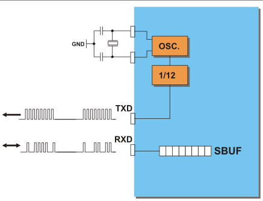
</p>

- In above application, SBUF is 8 bit register which is used for holding the received data.
- In similar manner Registers are used in different micro-controller for different purpose.


## Memory Allocation in C
When any program is loaded into the memory, it is organised into three parts called segments, which are:

- Text segment (the code segment)
- Stack segment
- Heap segment

### Text Segment
The text segment is where the compiled code of the program itself resides. This is the machine language representation of the program steps to be carried out, including all functions making up the program, both user and system defined. So, in general, an executable program generated by a compiler (like GCC) will have memory organisation. This part also contains the global, constant and also uninitialized variables.

### Stack
The stack is used to store variables used on the inside of a function (including the main() function). It’s a LIFO, “Last-In,-First-Out”, structure. Every time a function declares a new variable it is “pushed” onto the stack. Then when a function finishes running, all the variables associated with that function on the stack are deleted, and the memory they use is freed up. This leads to the “local” scope of function variables. The stack is a special region of memory, and automatically managed by the CPU – so you don’t have to allocate or deallocate memory.

TL;DR Variables allocated on the stack are stored directly to the memory and access to this memory is very fast, and its allocation is dealt with when the program is compiled

```c
#include<stdio.h>

void main()
{
    int a = 0;
    int b = 10;
    char c = 2;
    double d = 0.40;
    float e = 10000;

    printf("%p   %ld\n", &a, sizeof(a));
    printf("%p   %ld\n", &b, sizeof(b));
    printf("%p   %ld\n", &c, sizeof(c));
    printf("%p   %ld\n", &d, sizeof(d));
    printf("%p   %ld\n", &e, sizeof(e));
}

```
<p align="left">
        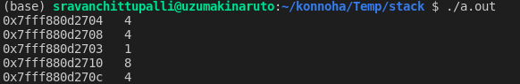
    </p>
You can observe that the stack grows up. 

If a program tries to put too much information on the stack, stack overflow will occur. Stack overflow happens when all the memory in the stack has been allocated, and further allocations begin overflowing into other sections of memory

### Heap

Unlike the stack, there's no enforced pattern to the allocation and deallocation of blocks from the heap; you can allocate a block at any time and free it at any time.

The heap is the diametrical opposite of the stack. The heap is a large pool of memory that can be used dynamically – it is also known as the “free store”. This is memory that is not automatically managed – you have to explicitly allocate (using functions such as malloc), and deallocate (e.g. free) the memory. Failure to free the memory when you are finished with it will result in what is known as a memory leak – memory that is still “being used”, and not available to other processes. Unlike the stack, there are generally no restrictions on the size of the heap (or the variables it creates), other than the physical size of memory in the machine. Variables created on the heap are accessible anywhere in the program.
Oh, and heap memory requires you to use pointers.

```c
#include <stdio.h>
#include <stdlib.h>

int x;          

int main(void) 
{
    int y;   
    char *str; 

    y = 4;
    printf("stack memory: %d\n", y);

    str = (char*)malloc(100*sizeof(char)); 
    str[0] = 'm';
    printf("heap memory: %c\n", str[0]); 
    free(str);         
    return 0;
}
```
<p align="center">
        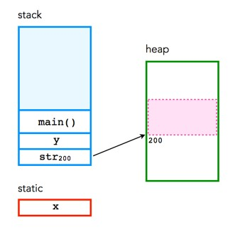
</p>

The variable `x` is static storage, because of its global nature. Both `y` and `str` are dynamic stack storage which is deallocated when the program ends. The function `malloc()` is used to allocate 100 pieces of of dynamic heap storage, each the size of `char`, to `str`. `str` is in the stack it only points to a memory location in heap. Conversely, the function `free()`, deallocates the memory associated with `str`. 


#### NOTE
You can use the stack if you know exactly how much data you need to allocate before compile time and it is not too big. You can use heap if you don't know exactly how much data you will need at runtime or if you need to allocate a lot of data.

## Types of Memory in Embedded Systems
Now we have seen how data is stored in memory but we have not seen about the different types of memory available. You can see that all types of data do not require a single type of memory i.e some need to be permanently stored and other can be discarded.

<p align="center">
    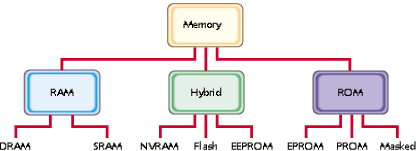
</p>

### Types Of RAM

The RAM family includes two important memory devices: static RAM (SRAM) and dynamic RAM (DRAM). The primary difference between them is the lifetime of the data they store. SRAM retains its contents as long as electrical power is applied to the chip. If the power is turned off or lost temporarily, its contents will be lost forever. DRAM, on the other hand, has an extremely short data lifetime-typically about four milliseconds. This is true even when power is applied constantly. There is a hardware known as DRAM controller whose job is to periodically refresh the memory.

SRAM devices offer extremely fast access times (approximately four times faster than DRAM) but are much more expensive to produce. Generally, SRAM is used only where access speed is extremely important. A lower cost-per-byte makes DRAM attractive whenever large amounts of RAM are required. Many embedded systems include both types: a small block of SRAM (a few kilobytes) along a critical data path and a much larger block of DRAM (perhaps even Megabytes) for everything else.

### Types Of ROM

Memories in the ROM family are distinguished by the methods used to write new data to them (usually called programming), and the number of times they can be rewritten. This classification reflects the evolution of ROM devices from hardwired to programmable to erasable-and-programmable. A common feature of all these devices is their ability to retain data and programs forever, even during a power failure.

The very first ROMs(masked ROM's) were hardwired devices that contained a preprogrammed set of data or instructions. 
<p align="center">
    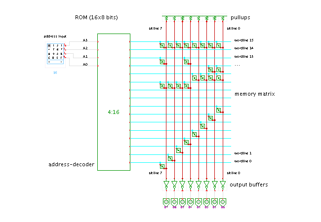
</p>

In masked ROM even if you want to change just one bit og data you will have to buy a new one.

One step up from the masked ROM is the PROM (programmable ROM), which is purchased in an unprogrammed state. If you were to look at the contents of an unprogrammed PROM, you would see that the data is made up entirely of 1's. The process of writing your data to the PROM involves a special piece of equipment called a device programmer. The device programmer writes data to the device one word at a time by applying an electrical charge to the input pins of the chip. Once a PROM has been programmed in this way, its contents can never be changed.

An EPROM (erasable-and-programmable ROM) is programmed in exactly the same manner as a PROM. However, EPROMs can be erased and reprogrammed repeatedly. To erase an EPROM, you simply expose the device to a strong source of ultraviolet light. (A window in the top of the device allows the light to reach the silicon.) By doing this, you essentially reset the entire chip to its initial--unprogrammed--state. Though more expensive than PROMs, their ability to be reprogrammed makes EPROMs an essential part of the software development and testing process.

### Types of Hybrid

As memory technology has matured in recent years, the line between RAM and ROM has blurred. We take the best out of the two worlds i.e storing capacity of ROM and reprogramable property of RAM. 

EEPROMs are electrically-erasable-and-programmable. Internally, they are similar to EPROMs, but the erase operation is accomplished electrically, rather than by exposure to ultraviolet light. Any byte within an EEPROM may be erased and rewritten. Once written, the new data will remain in the device forever--or at least until it is electrically erased. Obviously the cost is higher.

Flash memory combines the best features of the memory devices described thus far. Flash memory devices are high density, low cost, nonvolatile, fast (to read, but not to write), and electrically reprogrammable. These advantages are overwhelming and, as a direct result, the use of flash memory has increased dramatically in embedded systems. From a software viewpoint, flash and EEPROM technologies are very similar. The major difference is that flash devices can only be erased one sector at a time, not byte-by-byte. Typical sector sizes are in the range 256 bytes to 16KB. Despite this disadvantage, flash is much more popular than EEPROM and is rapidly displacing many of the ROM devices as well.

# Bootloader

Bootloader is a software code(written by manufacturer) that resides in microcontroller memory. This code helps microcontroller to get programmed from host PC. Generally RS232 UART protocol is used to program the controller but some of them also use SPI, I2C or Modbus ASCII.

When microcontroller is powered ON or reset, it checks for the bootloader condition. If condition is satisfied then bootloader code will be executed and if not, then user application will start running. Bootloader condition can be checked either by hardware or software.

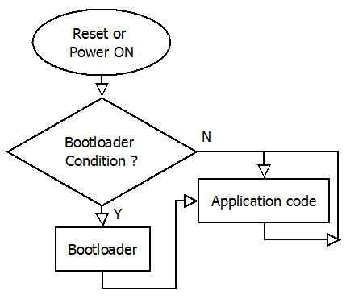

The bootloader is stored in an area of protected memory (although this area of memory is not always fool-proof and can be overwritten by a stack overflow, for example). An onboard bootloader resides in memory in an MCU in an area of ROM or flash memory that is protected from getting written over. A bootloader performs various hardware checks, initializes the processor and peripherals, and does other tasks like partitioning or configuring registers. 

Besides getting a system on its feet, bootloaders are also used to update MCU firmware later on. Bootloaders must be able to communicate with the outside world in order to get updates, so most bootloaders are able to communicate with some form of interface, be it I2C, SPI, USART, USB, or some other protocol. Bootloaders also need to be able to map the memory of the specific architecture and read, write, and partition memory. If EEPROM is present, a bootloader must be able to at least read the EEPROM, as this is where the next bit of code might come from.

# Flashing a microcontroller and bootloaders role in it

Lets take the example of ESP32:

Bootloader performs the following functions:

* Minimal initial configuration of internal modules
* Select the application partition to boot, based on the partition table and ota_data (if any)
* Load this image to RAM (IRAM & DRAM) and transfer management to it.

So, the ESP32 has a bit of advanced bootloader which can even manage OTA updates. Next steps will be shown hands on

# Assignment

* [Assignment 3](../assets/week3/embedded_assignment_3.pdf)