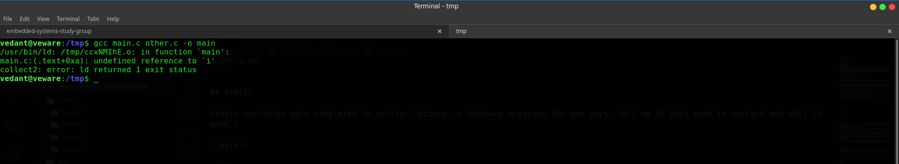
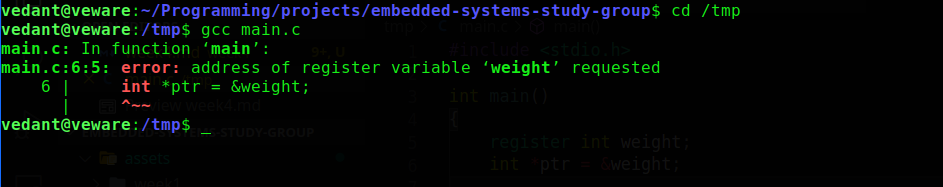
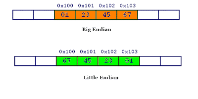

# Embedded Systems Study Group

- [Embedded Systems Study Group](#embedded-systems-study-group)
- [Dynamic Memory](#dynamic-memory)
  - [Use](#use)
  - [Accessing](#accessing)
  - [Precautions](#precautions)
  - [Memory Leak](#memory-leak)
  - [Memory Fragmentation](#memory-fragmentation)
- [Storage Classes in C](#storage-classes-in-c)
  - [auto](#auto)
  - [extern](#extern)
  - [static](#static)
  - [register](#register)
- [Byte ordering](#byte-ordering)

# Dynamic Memory

## Use
When a variable is defined in the source program, the type of the variable determines how much memory the compiler allocates. When the program executes, the variable consumes this amount of memory regardless of whether the program actually uses the memory allocated. This is particularly true for arrays. However, in many situations, it is not clear how much memory the program will actually need.  For example, we may have declared arrays to be large enough to hold the maximum number of elements we expect our application to handle. If too much memory is allocated and then not used, there is a waste of memory.  If not enough memory is allocated, the program is not able to fully handle the input data. We can make our program more flexible if, during execution, it could allocate initial and additional memory when needed and free up the memory when it is no more needed. Allocation of memory during execution is called dynamic memory allocation. C provides library functions to allocate and free up memory dynamically during program execution.  Dynamic memory is allocated on the heap by the system.

## Accessing

There is a family of four functions which allow programs to dynamically allocate memory on the heap.
In order to use these functions you have to include the stdlib.h header file in your program.

- malloc()

```c
        void * malloc (size_t nbytes);
```
`nbytes` is the number of bytes that to be assigned to the pointer. The function returns a pointer of type `void*`.  When allocating memory, `malloc()` returns a pointer which is just a byte address. Thus, it does not point to an object of a specific type. A pointer type that does not point to a specific data type is said to point tovoid type, that is why we have to type cast the value to the type of the destination pointer, for example:

```c
        char* test;
        test = (char*) malloc(10);
```

- calloc()

```c
        void* calloc (size_t nelements, size_t size);
```
calloc() is very similar to malloc() in its operation except its prototype have two parameters.  These two parameters are multiplied to obtain the total size of the memory block to be assigned. Usually the first parameter (nelements) is the number of elements and the second one (size) serves to specify the size of each element. For example, we could define test with calloc():

```c
        int* test;
        
        test = (int *) calloc(5, sizeof(int));
```
NOTE:- `calloc() initializes all its elements to 0`

- realloc()

  ```c
          void* realloc (void * pointer, size_t elemsize);
  ```
It changes the size of a memory block already assigned to a pointer.  pointer parameter receives a pointer to the already assigned memory block and size specifies the new size that the memory block shall have. The function assigns size bytes of memory to the pointer. The function may need to change the location of the memory block so that the new size can fit; in that case the present content of the block is copied to the new one. The new pointer is returned by the function and if it has not been possible to assign the memory block with the new size it returns a null pointer.

  ```c
          int *ptr = (int *)malloc(sizeof(int)*2); 

          int *ptr_new; 
          ptr_new = (int *)realloc(ptr, sizeof(int)*3);
  ```

- free()

  ```c
          void free (void * pointer);
  ```
It releases a block of dynamic memory previously assigned using malloc(),calloc() or realloc().  This function must only be used to release memory assigned with functions malloc(),calloc() and realloc().

## Precautions

- One must always verify whether the pointer returned is NULL.   
  ```c
          if (theptr != NULL)
  ```

- Appropriately cast to the type of required pointer. If malloc() is successful, objects in dynamically allocated memory can be accessed indirectly by dereferencing the pointer or by indexing like we do with arrays.

- If allocating memory for a string, don't forget to allocate , one extra byte for the null terminator of the string.

- After you have used the block of memory, do not forget to free the memory block using `free()`.

## Memory Leak

It is easy to introduce memory leaks into application code implemented using malloc() and free(). This is caused by memory being allocated and never being deallocated. Such errors tend to cause a gradual performance degradation and eventual failure. This type of bug can be very hard to locate.

## Memory Fragmentation

The best way to understand memory fragmentation is to look at an example. For this example, it is assumed hat there is a 10K heap. First, an area of 3K is requested, thus:
  ```c
           #define K (1024)
           char *p1;
           p1 = malloc(3*K);
  ```
Then, a further 4K is requested:
  ```c
          p2 = malloc(4*K);
  ```
3K of memory is now free.

Some time later, the first memory allocation, pointed to by p1, is de-allocated:
  ```c
          free(p1);
  ```
This leaves 6K of memory free in two 3K chunks. A further request for a 4K allocation is issued:
  ```c
         p1 = malloc(4*K);
  ```
This results in a failure – NULL is returned into p1 – because, even though 6K of memory is available, there is not a 4K contiguous block available. This is memory fragmentation.

# Storage Classes in C

A storage class represents the visibility and a location of a variable. It tells from what part of code we can access a variable. 

A storage class is used to describe the following things:

- The variable scope.
- The location where the variable will be stored.
- The initialized value of a variable.
- A lifetime of a variable.
- Who can access a variable?

Thus a storage class is used to represent the information about a variable. A variable is not only associated with a data type, its value but also a storage class. 

## auto

- They are declared at the start of a program’s block such as in the curly braces ( { } ). Memory is allocated automatically upon entry to a block and freed automatically upon exit from the block. 

- The scope of an auto variable is limited with the particular block only. Once the control goes out of the block, the access is destroyed. This means only the block in which the auto variable is declared can access it.

- The scope of automatic variables is local to the block in which they are declared, including any blocks nested within that block. For these reasons, they are also calledl local variables.

- No block outside the defining block may have direct access to automatic variables (by variable name) but, they may be accessed indirectly by other blocks and/or functions using pointers.

- Automatic variables may be specified upon declaration to be of storage class auto.  However, it is not required to use the keyword auto because by default, storage class within a block is auto.

- Automatic variables declared with initializers are initialized every time the block in which they are declared is entered or accessed.

```c
#include <stdio.h>

int main( )
{
  auto int j = 1;
  {
    auto int j = 2;
    {
      auto int j = 3;
      printf(" %d ", j);
    }
    printf("\t %d ",j);
  }
  printf("%d\n", j);

  return 0;
}
```

Output: `3 2 1`

## extern

In some applications it may be useful to have data which is accessible from within any block and/or which remains in existence for the entire execution of the program.  Such variables are called global variables, and the C language provides storage classes which can meet these requirements; namely, the external (extern) and static (static) classes.
Declaration for external variable is as follows: `extern int var;`

External variables may be declared outside any function block in a source code file the same way any other variable is declared; by specifying its type and name (extern keyword may be omitted). But say an variable is defined in file1.c and used in file2.c and file3.c then the `extern` keyword must be used in file2.c and file3.c.

The scope of external variables is global, i.e. the entire source code in the file following the declarations. All functions following the declaration may access the external variable by using its name.  However, if a local variable having the same name is declared within a function, references to the name will access the local variable cell.

External variables may be initialized in declarations just as automatic variables; however, the initializers must be constant expressions. The initialization is done only once at compile time, i.e. when memory is allocated for the variables. In general, it is a good programming practice to avoid using external variables as they destroy the concept of a function as a 'black box' or independent module.


* main.c
  
  ```c
  #include <stdio.h>

  extern int i;

  int main() 
  {
     printf("value of the external integer is = %d\n", i);
     
     return 0;
  }
  ```

* other.c

  ```c
  #include <stdio.h>

  int i=48;
  ```

Output: `value of the external integer is = 48`

## static

Static variables were completed in earlier lecture, followup question for you guys, tell me if this code is correct and will it work ?

* main.c
  
  ```c
  #include <stdio.h>

  extern int i;

  int main() 
  {
     printf("value of the external integer is = %d\n", i);
     
     return 0;
  }
  ```

* other.c

  ```c
  #include <stdio.h>

  static int i=48;
  ```

command: `gcc main.c other.c -o main`

<details>
<summary>Answer</summary>
<br>
It won't compile as we can't extern a static variable, as the scope of a static variable is limited only to its translation unit, i.e if defined in a function, it can't be seen by other functions, similarly if defined globally in a source file other source files can't access it.


If you recall, we get undefined reference error when we didnot include a object file of a function and used it, same happens here, as extern expects a variable defined in some other source file, but it cannot find the variable, as it is static, thus it's visibility is restricted only to the source file where it is defined, `other.c` and not `main.c`

</details>

## register

You can use the register storage class when you want to store local variables within functions or blocks in CPU registers instead of RAM to have quick access to these variables. For example, "counters" are a good candidate to be stored in the register. The variables declared using register storage class has lifespan throughout the program. 

The register storage class specifier indicates to the compiler that the object should be stored in a machine register. The register storage class specifier is typically specified for heavily used variables, such as a loop control variable, in the hopes of enhancing performance by minimizing access time. However, the compiler is not required to honor this request. Because of the limited size and number of registers available on most systems, few variables can actually be put in registers. If the compiler does not allocate a machine register for a register object, the object is treated as having the storage class specifier auto.

The following restrictions apply to the register storage class specifier:

- You cannot use pointers to reference objects that have the register storage class specifier.
- You cannot use the register storage class specifier when declaring objects in global scope.
- A register does not have an address. Therefore, you cannot apply the address operator (&) to a register variable.

```c
#include <stdio.h>

int main() 
{
    register int weight;
    int *ptr = &weight;
    
    return 0;
}
```

* This will give an error as follows:

  

Since, register doesn't have an address we cannot request it's address using `&` operator.

* The following code will work correctly:

  ```c
  #include <stdio.h>

  int main() 
  {
      register int weight = 89;

      printf("%d\n", weight);
      return 0;
  }
  ```

  Output: `89`

# Byte ordering

Little and big endian are two ways of storing multibyte data-types ( int, float, etc). In little endian machines, last byte of binary representation of the multibyte data-type is stored first. On the other hand, in big endian machines, first byte of binary representation of the multibyte data-type is stored first.



Let's see an example:

```c
int *i; // pointer to an int (4 bytes on 32-bit machine)
i = 0;  // points to location zero, so *i is the value there
```

What is the value of i?

Big endian machine: An int is 4 bytes, and the first is the largest. I read 4 bytes (W X Y Z) and W is the largest. The number is 0x12345678.
Little endian machine: Sure, an int is 4 bytes, but the first is smallest. I also read W X Y Z, but W belongs way in the back -- it's the littlest. The number is 0x78563412.

<iframe src="https://instacalc.com/1067/embed" width="450" height="350" frameborder="0"></iframe>

Use this code to check endianness on your computer

```c
#include <stdio.h> 
int main()  
{ 
   unsigned int i = 1; 
   char *c = (char*)&i; 
   if (*c)     
       printf("Little endian"); 
   else
       printf("Big endian"); 
   getchar(); 
   return 0; 
} 
```

Note: There is no difference between performance in little endian and big endian machines, it's just a matter of convention.
