# Embedded Systems Study Group
- [Embedded Systems Study Group](#embedded-systems-study-group)
- [Basic of ADC and DAC](#basic-of-adc-and-dac)
    - [ADC](#adc)
    - [DAC](#dac)
    - [R-2R Ladder DAC](#r-2r-ladder-dac)
    - [Application](#application)
- [ESP32 DAC](#esp32-dac)
- [ESP32 ADC](#esp32-adc)
- [Bit manipulations](#bit-manipulations)
  - [and operator](#and-operator)
  - [or operator](#or-operator)
  - [<< operator](#-operator)
  - [>> operator](#blockquoteblockquoteoperatorblockquoteblockquote)
- [GPIO](#gpio)
  - [Implementation](#implementation)
  - [GPIO's on ESP32](#gpios-on-esp32)
    - [Config GPIOs](#config-gpios)
    - [Set GPIOs](#set-gpios)
    - [Get GPIOs](#get-gpios)
    - [How are GPIO's handled internally](#how-are-gpios-handled-internally)
  - [Peripheral register map in ESP32](#peripheral-register-map-in-esp32)
  - [GPIO register map in ESP32](#gpio-register-map-in-esp32)
  - [Using GPIO registers to read/write from GPIOs](#using-gpio-registers-to-readwrite-from-gpios)
    - [Led blink using struct to access registers](#led-blink-using-struct-to-access-registers)
    - [Button input using struct to access registers](#button-input-using-struct-to-access-registers)
    - [Led blink using direct memory access](#led-blink-using-direct-memory-access)
    - [Button input using direct memory access](#button-input-using-direct-memory-access)

 
# Basic of ADC and DAC:

## ADC
<p align="center">
    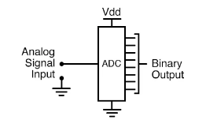
</p>

- As you can see from the image, an ADC converts input analog signal to Digital Binary Output

## DAC
<p align="center">
    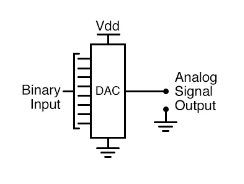
</p>

- On the other hand, a DAC inputs a binary number and outputs an analog voltage or current signal.

## R-2R Ladder DAC:
<p align="center">
    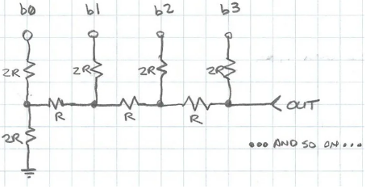
</p>

- The R-2R resistor ladder network directly converts a parallel digital symbol/word into an analog voltage. Each digital input (b0, b1, etc.) adds its own weighted contribution to the analog output. 
- B3 is the MSB and B0 is the LSB.

- These concept should be clear before understanding ladder network

<p align="center">
    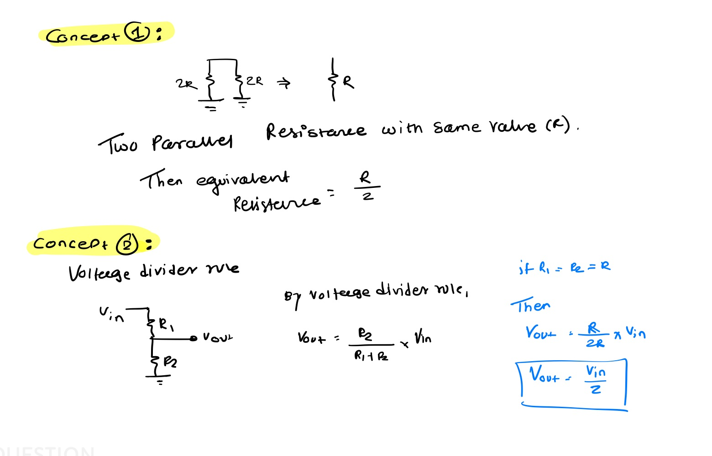
</p>

- Derivation:
<p align="center">
    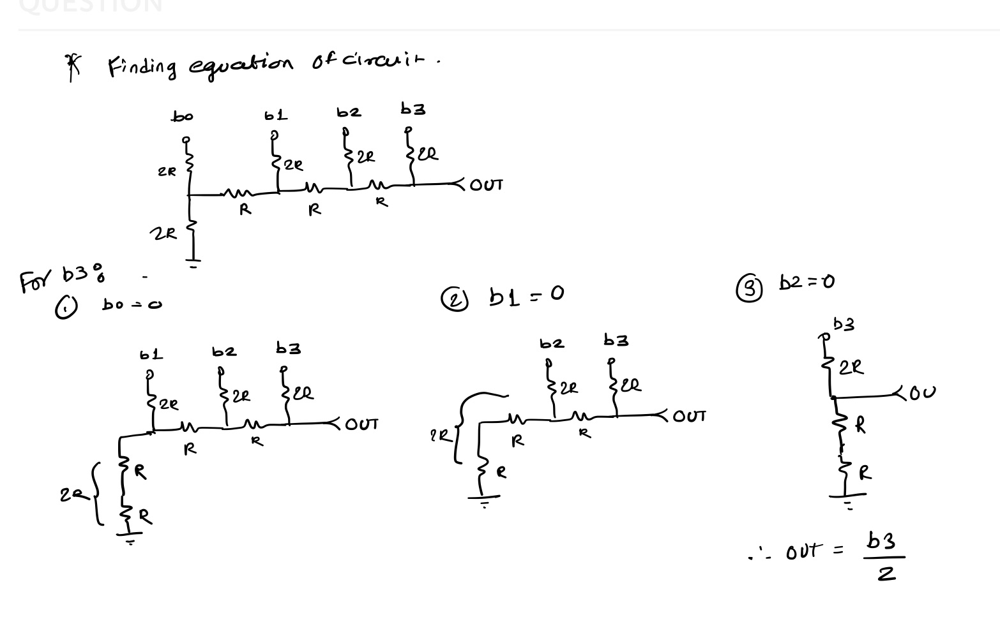
</p>

- [More Info On derivation](https://in.tek.com/blog/tutorial-digital-analog-conversion-r-2r-dac)
- Final Formula:
<p align="center">
    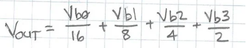
</p>

## Application
- Together, they are often used in digital systems to provide complete interface with analog sensors and output devices for control systems such as those used in automotive engine controls:

<p align="center">
    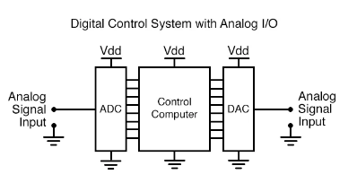
</p>

# ESP32 DAC
- ESP32 has two 8-bit DAC (digital to analog converter) channels, connected to **GPIO25** (Channel 1) and **GPIO26** (Channel 2).
- The DAC driver allows these channels to be set to arbitrary voltages.
- How to Use ESP32's DAC:
    1. First enable DAC using:
    > dac_output_enable(DAC_CHANNEL_1); &nbsp; &nbsp; //Channel 1 = GPIO25
    2. Write Output Voltage on DAC:
    > dac_output_voltage(DAC_CHANNEL_1, 200); 
- Formula for DAC:  
   **Channel Output = (VDD * dac_output_voltage / 255)**&nbsp; &nbsp; {VDD : 3.3V} <br />
    In above example, dac_output_voltage was 200.<br />
    Channel Output = (3.3 * 200 / 255) = 2.58V
## ESP32 DAC code for triangular wave:
- [esp-idf-template](https://github.com/espressif/esp-idf-template)
> git clone https://github.com/espressif/esp-idf-template<br />
 paste below code in main.c

```c
#include <stdio.h>
#include "freertos/FreeRTOS.h"
#include "freertos/task.h"
#include <driver/dac.h>


void app_main(void)
{
    dac_output_enable(DAC_CHANNEL_1);
    while (1) {
        for(int i = 0; i <= 255; i++)
        {
           dac_output_voltage(DAC_CHANNEL_1, i); 
           printf("%d\n", i);
           vTaskDelay(10 / portTICK_PERIOD_MS);
        }
        for(int i = 255; i >= 0; i--)
        {
           dac_output_voltage(DAC_CHANNEL_1, i); 
           printf("%d\n", i);
           vTaskDelay(10 / portTICK_PERIOD_MS);
        }        
        
    }
}

```

- Serial Plotter Output: (Ideal Output)
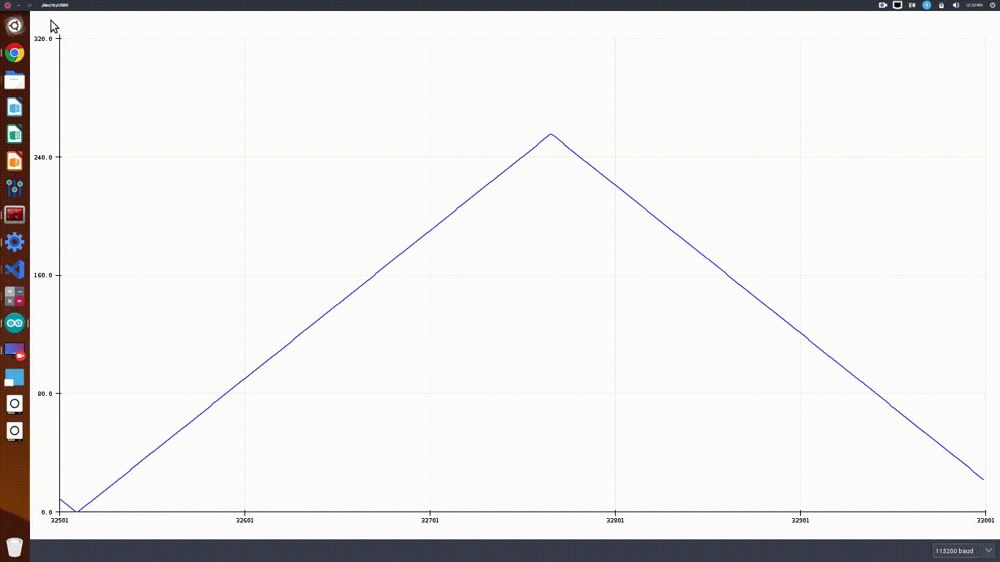


# ESP32 ADC
- The ESP32 integrates two 12-bit SAR (Successive Approximation Register) ADCs, supporting a total of 18 measurement channels (analog enabled pins).
- The ADC driver API supports ADC1 (8 channels, attached to GPIOs 32 - 39), and ADC2 (10 channels, attached to GPIOs 0, 2, 4, 12 - 15 and 25 - 27). 
```c
ADC1_CH0 – GPIO36
ADC1_CH1 – GPIO37
ADC1_CH2 – GPIO38
ADC1_CH3 – GPIO39
ADC1_CH4 – GPIO32
ADC1_CH5- GPIO33
ADC1_CH6 – GPIO34
ADC1_CH7 – GPIO35
ADC2_CH0 – GPIO4
ADC2_CH1 – GPIO0
ADC2_CH2 – GPIO2
ADC2_CH3 – GPIO15
ADC2_CH4 – GPIO13
ADC2_CH5 – GPIO12
ADC2_CH6 – GPIO14
ADC2_CH7 – GPIO27
ADC2_CH8 – GPIO25
ADC2_CH9 – GPIO26
```
- How to Use ESP32's ADC:
1. config the width of ADC channel by 
> adc1_config_width(ADC_WIDTH_BIT_12); &nbsp; &nbsp; //ADC 1 configured to 12 Bit Width
2. config the attenuation of ADC channel by 
> adc1_config_channel_atten(ADC1_CHANNEL_0,ADC_ATTEN_DB_11); &nbsp; &nbsp; // ADC channel 0 configured to attenuation 11dB

<p align="center">
    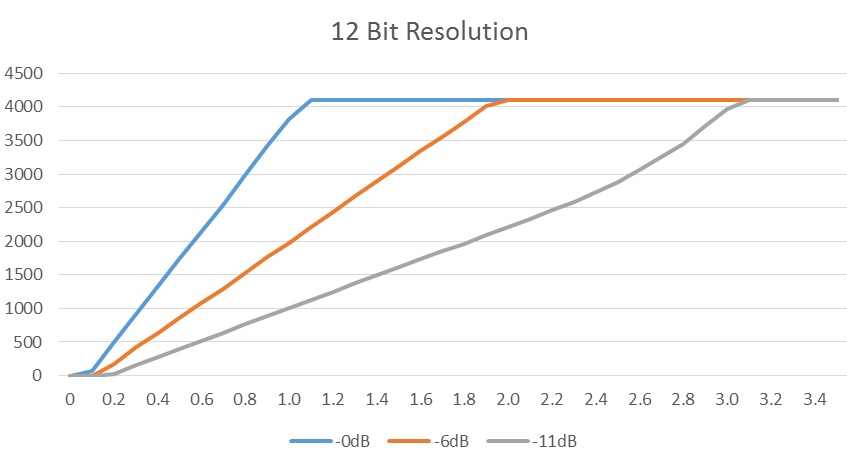
</p>

3. These are minimal initialization required for adc, then raw readings can be read using followig function:
> int val = adc1_get_raw(ADC1_CHANNEL_0);
4. For more accurate operation one should calibrate and characterize adc before reading adc raw values.<br>
For more information checkout this adc example code:  [adc1_example](https://github.com/espressif/esp-idf/blob/master/examples/peripherals/adc/main/adc1_example_main.c)

## ESP32 ADC code for reading input wave:

```c
#include <stdio.h>
#include "freertos/FreeRTOS.h"
#include "freertos/task.h"
#include <driver/dac.h>
#include <driver/adc.h>

void adc_task(void *arg)
{
    adc1_config_width(ADC_WIDTH_BIT_12);
    adc1_config_channel_atten(ADC1_CHANNEL_0,ADC_ATTEN_DB_11); 
    int val = adc1_get_raw(ADC1_CHANNEL_0);
	while(1)
	{	
        val = adc1_get_raw(ADC1_CHANNEL_0);
        printf("%d\n", val);
        vTaskDelay(10 / portTICK_PERIOD_MS);  
    }
	
}

void dac_task(void *arg)
{
    dac_output_enable(DAC_CHANNEL_1);
    while (1) {
        for(int i = 0; i <= 255; i++)
        {
           dac_output_voltage(DAC_CHANNEL_1, i); 
           //printf("%d\n", i);
           vTaskDelay(10 / portTICK_PERIOD_MS);
        }
        for(int i = 255; i >= 0; i--)
        {
           dac_output_voltage(DAC_CHANNEL_1, i); 
           //printf("%d\n", i);
           vTaskDelay(10 / portTICK_PERIOD_MS);
        }  
            
    }
}
       
void app_main(void)
{
    xTaskCreate(&adc_task,"adc_task",4096,NULL,1,NULL);
    xTaskCreate(&dac_task,"dac_task",4096,NULL,1,NULL);
}

```

- Serial Plotter Output: (Actual ADC Output)
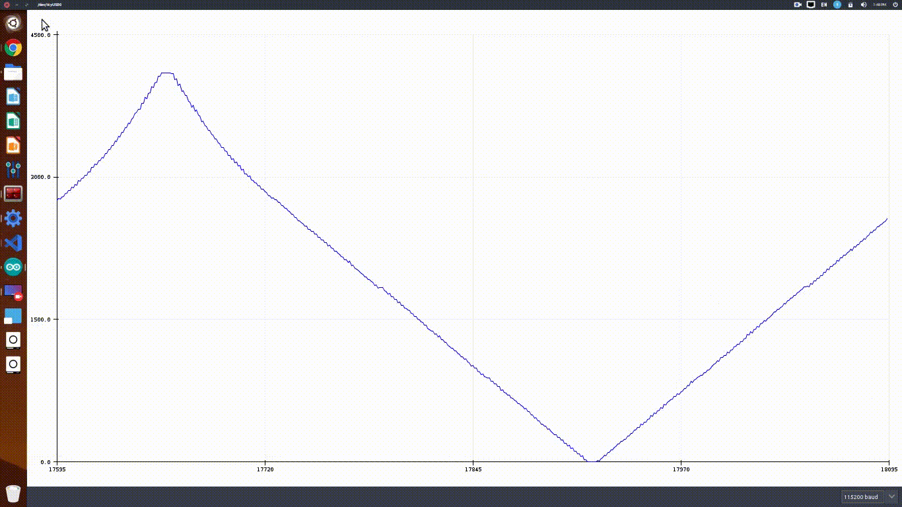

# Bit manipulations

## and operator

`a & b` does bitwise and of the two values

* `1 & 1 = 1`
* `1 & 0 = 0`
* `0 & 1 = 0`
* `0 & 0 = 0`

```c
#include <stdio.h>

int main()
{
    unsigned int val1 = 0x1;
    unsigned int val2 = 0x0;
    unsigned int result = val1 & val2;

    printf("decimal: %d hex: %x\n", result, result);
}
```

output: `decimal: 0 hex: 0`

## or operator

`a | b` does bitwise or of the two values

* `1 | 1 = 1`
* `1 | 0 = 1`
* `0 | 1 = 1`
* `0 | 0 = 0`

```c
#include <stdio.h>

int main()
{
    unsigned int val1 = 0x1;
    unsigned int val2 = 0x0;
    unsigned int result = val1 | val2;

    printf("decimal: %d hex: %x\n", result, result);
}
```

output: `decimal: 1 hex: 1`

## << operator

`a << b` left shifts a by b times.

if a = 00001001 and b = 2, then `a << b = 00100100`

```c
#include <stdio.h>

void print_bin(unsigned int integer)
{
    int i = 8 * sizeof(int); /* however many bits are in an integer */
    while(i--) {
        putchar('0' + ((integer >> i) & 1)); 
    }
    putchar('\n');
}

int main()
{
    unsigned int val = 0x1;

    for(int i = 0; i < 32; i++)
    {
        print_bin(val);
        val = val << 1;
    }
}
```

output:

```
00000000000000000000000000000001
00000000000000000000000000000010
00000000000000000000000000000100
00000000000000000000000000001000
00000000000000000000000000010000
00000000000000000000000000100000
00000000000000000000000001000000
00000000000000000000000010000000
00000000000000000000000100000000
00000000000000000000001000000000
00000000000000000000010000000000
00000000000000000000100000000000
00000000000000000001000000000000
00000000000000000010000000000000
00000000000000000100000000000000
00000000000000001000000000000000
00000000000000010000000000000000
00000000000000100000000000000000
00000000000001000000000000000000
00000000000010000000000000000000
00000000000100000000000000000000
00000000001000000000000000000000
00000000010000000000000000000000
00000000100000000000000000000000
00000001000000000000000000000000
00000010000000000000000000000000
00000100000000000000000000000000
00001000000000000000000000000000
00010000000000000000000000000000
00100000000000000000000000000000
01000000000000000000000000000000
10000000000000000000000000000000
```

## >> operator

`a >> b` right shifts a by b times.

if a = 00001001 and b = 2, then `a << b = 00000010`

```c
#include <stdio.h>

void print_bin(unsigned int integer)
{
    int i = 8 * sizeof(int); /* however many bits are in an integer */
    while(i--) {
        putchar('0' + ((integer >> i) & 1)); 
    }
    putchar('\n');
}

int main()
{
    unsigned int val = 0x80000000;

    for(int i = 0; i < 32; i++)
    {
        print_bin(val);
        val = val << 1;
    }
}
```

output:

```
10000000000000000000000000000000
01000000000000000000000000000000
00100000000000000000000000000000
00010000000000000000000000000000
00001000000000000000000000000000
00000100000000000000000000000000
00000010000000000000000000000000
00000001000000000000000000000000
00000000100000000000000000000000
00000000010000000000000000000000
00000000001000000000000000000000
00000000000100000000000000000000
00000000000010000000000000000000
00000000000001000000000000000000
00000000000000100000000000000000
00000000000000010000000000000000
00000000000000001000000000000000
00000000000000000100000000000000
00000000000000000010000000000000
00000000000000000001000000000000
00000000000000000000100000000000
00000000000000000000010000000000
00000000000000000000001000000000
00000000000000000000000100000000
00000000000000000000000010000000
00000000000000000000000001000000
00000000000000000000000000100000
00000000000000000000000000010000
00000000000000000000000000001000
00000000000000000000000000000100
00000000000000000000000000000010
00000000000000000000000000000001
```

# GPIO

A General Purpose Input/output (GPIO) is an interface available on most modernmicrocontrollers (MCU) to provide an ease of access to the device's internal properties.

Generally there are multiple GPIO pins on a single MCU for the use of multiple interaction for simultaneous application. The pins can be programmed as input, where data from some external source is being fed into the system to be manipulated at a desired time and location. Output can also be performed on GPIOs.

GPIOs are used in a diverse variety of applications, limited only by the electrical and timing specifications of the GPIO interface and the ability of software to interact with GPIOs in a sufficiently timely manner.

## Implementation

GPIO interfaces vary widely. In some cases, they are simple, group of pins that can switch as a group to either input or output. In others, each pin can be set up to accept or source different logic voltages, with configurable drive strengths and pull ups/downs.

A GPIO pin's state may be exposed to the software developer through one of a number of different interfaces, such as a memory-mapped I/O peripheral, or through dedicated IO port instructions.

A GPIO port is a group of GPIO pins (usually 8 GPIO pins) arranged in a group and controlled as a group.

GPIO abilities may include:

* GPIO pins can be configured to be input or output
* GPIO pins can be enabled/disabled
* Input values are readable (usually high or low)
* Output values are writable/readable
* Input values can often be used as IRQs (usually for wakeup events)

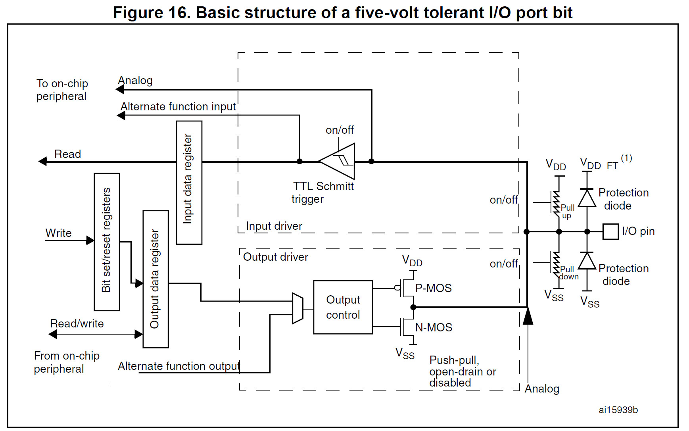

## GPIO's on ESP32

Each gpio can be controlled using register inside the ESP32, but to make our life easy espressif provides a SDK, called ESP-IDF which handles all the talking/reading from the registers and provides nice C functions to use the GPIO, following is the C code to setup GPIO on the esp32, this seems a bit complex but it isn't. `gpio_conf_t` is a struct defined in the source code, which holds all the gpio settings.

### Config GPIOs

```c
gpio_config_t io_conf;
// bit mask for the pins, each bit maps to a GPIO 
io_conf.pin_bit_mask = (1ULL<<21);

// set gpio mode to input
io_conf.mode = GPIO_MODE_INPUT;

// enable pull up resistors
io_conf.pull_up_en = 1;

// disable pull down resistors
io_conf.pull_down_en = 0;

// disable gpio interrupts
io_conf.intr_type = GPIO_INTR_DISABLE;

// detailed description can be found at https://docs.espressif.com/projects/esp-idf/en/latest/esp32/api-reference/peripherals/gpio.html#_CPPv413gpio_config_t

// configure gpio's according to the setting specified in the gpio struct
esp_err_t err = gpio_config(&io_conf);
```

This the definition of gpio struct 

```c
typedef struct {
    uint64_t pin_bit_mask;          /*!< GPIO pin: set with bit mask, each bit maps to a GPIO */
    gpio_mode_t mode;               /*!< GPIO mode: set input/output mode                     */
    gpio_pullup_t pull_up_en;       /*!< GPIO pull-up                                         */
    gpio_pulldown_t pull_down_en;   /*!< GPIO pull-down                                       */
    gpio_int_type_t intr_type;      /*!< GPIO interrupt type                                  */
} gpio_config_t;
```

This can be found in `esp/esp-idf/components/soc/include/hal/gpio_types.h`

### Set GPIOs

To set value of a gpio, we use the following function `gpio_set_level()`, so if we want to set HIGH to gpio 21, we'll do this: `gpio_set_level((gpio_num_t)21, 1)`

Internal Implementation of this function is as follows

```c
static inline void gpio_ll_set_level(gpio_dev_t *hw, gpio_num_t gpio_num, uint32_t level)
{
    if (level) {
        if (gpio_num < 32) {
            hw->out_w1ts = (1 << gpio_num);
        } else {
            hw->out1_w1ts.data = (1 << (gpio_num - 32));
        }
    } else {
        if (gpio_num < 32) {
            hw->out_w1tc = (1 << gpio_num);
        } else {
            hw->out1_w1tc.data = (1 << (gpio_num - 32));
        }
    }
}
```

As you can see, the variable out_w1ts is set to `1 << gpio_num`, as this registers represents the register used to manipulate gpio pins, so we are setting bits of this register to accordingly set it's value in the pin.

This can be found in `esp/esp-idf/components/soc/include/hal/gpio_ll.h`

### Get GPIOs

To get value of a gpio, we use the following function `gpio_get_level()`, so if we want to get value of gpio 21, we'll do this: `gpio_get_level((gpio_num_t)21)`

```c
static inline int gpio_ll_get_level(gpio_dev_t *hw, gpio_num_t gpio_num)
{
    if (gpio_num < 32) {
        return (hw->in >> gpio_num) & 0x1;
    } else {
        return (hw->in1.data >> (gpio_num - 32)) & 0x1;
    }
}
```

This can be found in `esp/esp-idf/components/soc/include/hal/gpio_ll.h`

Similarly here we are reading from the input register, which stores the input value of the register and if it is HIGH, the bit is set to 1, or else 0. These registers are mapped to a single gpio pin, but using a mux which is setup while config, we can point this pin to either in/out registers.

We use bit manipulation to find the value stored at that specific bit, so here we right shift value stored in `variable in` and thus the required bit is the leftmost bit, then we bitwise and it with `0x1`. So, if value of pin is 1, then `1 & 1 = 1` and if it is 0, then `0 & 1 = 0`


### How are GPIO's handled internally

As we read earlier, these gpio's are controlled using registers. There registers have been memory mapped, so consider them as a variable pointer which can then be manipulated to set their values.

Typically when we access registers in C based on memory-mapped IO we use a pointer notation to ‘trick’ the compiler into generating the correct load/store operations at the absolute address needed.

Below is the struct used to control the gpio's, inshort this struct is used to represent the registers in our code as variables. Since a struct is stored as contagious memory location, so if we set the starting address of the this struct to that of the peripheral registers, we can use the struct to manipulate those registers.

Dealing with a memory mapped register is really no different than dealing with any other kind of pointer to memory. The memory mapped file is just a block of data that you can read and write to from any process using the same name. 

```c
typedef volatile struct gpio_dev_s {
    uint32_t bt_select;                             /*NA*/
    uint32_t out;                                   /*GPIO0~31 output value*/
    uint32_t out_w1ts;                              /*GPIO0~31 output value write 1 to set*/
    uint32_t out_w1tc;                              /*GPIO0~31 output value write 1 to clear*/

// ....
// ....
// there's more stuff here, but it is not relevant for our lecture
// ....
// ....

uint32_t in;                                    /*GPIO0~31 input value*/
union {
    struct {
        uint32_t data:       8;                 /*GPIO32~39 input value*/
        uint32_t reserved8: 24;
    };
    uint32_t val;
} in1;

// ....
// ....
// there's more stuff here, but it is not relevant for our lecture
// ....
// ....

} gpio_dev_t;
extern gpio_dev_t GPIO;
```

This can be found in `esp/esp-idf/components/soc/soc/esp32/include/soc/gpio_struct.h`

How do we set this struct to specific memory location, here's how we do that !

```c
struct volatile gpio_dev_t *__gpio_reg = (void*)0x3FF44000;
```

## Peripheral register map in ESP32

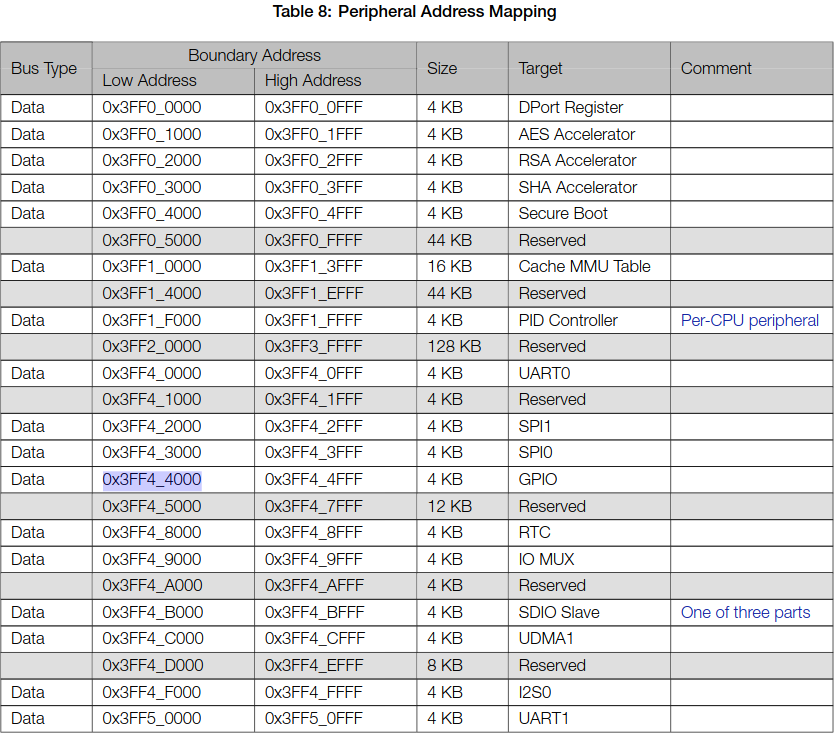

As we can see the address of GPIO peripheral is `0x3FF4_4000`, thus if we point our struct to that address we can write to the register and control the gpio's

## GPIO register map in ESP32

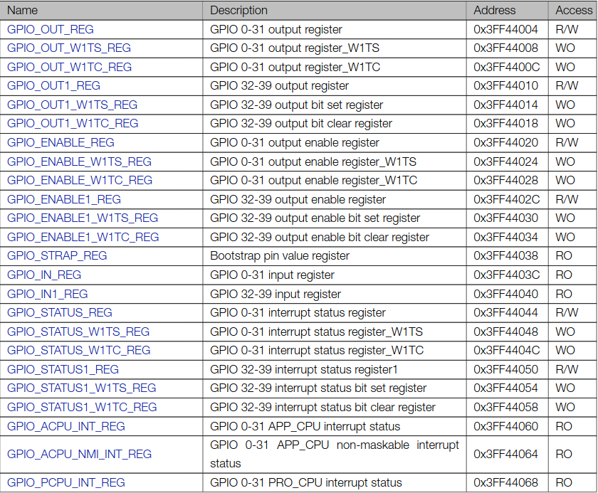
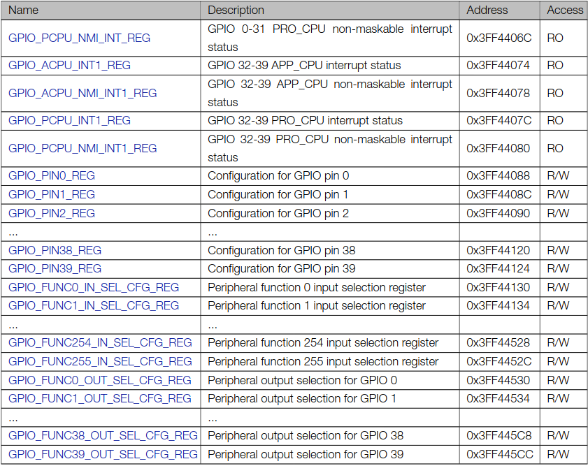

This is the GPIO Register map for GPIO registers in ESP32, each of these register is a 32bit register and has a separate address. So we can individually manipulate each register using it's address.

The registers that are important for us are the following `GPIO_OUT_REG`, `GPIO_OUT_W1TS_REG`, `GPIO_OUT_W1TC_REG` and `GPIO_IN_REG`. We can use these registers to manipulate GPIO's, i.e. read and write from these registers to actually set output HIGH/LOW or read the input on gpios.

* `GPIO_OUT_REG` - GPIO0-31 output value, if it is 1, then corresponding GPIO gives high if it is 0, then low.
* `GPIO_OUT_W1TS_REG` - Rather than manipulating the main `GPIO_OUT_REGISTER`, we can write to this register to output HIGH on the corresponding pin. For every bit that is 1 in the value written here, the corresponding bit in `GPIO_OUT_REG` will be set(set to 1).
*  `GPIO_OUT_W1TC_REG` - Rather than manipulating the main `GPIO_OUT_REGISTER`, we can write to this register to output LOW to the corresponding pin. For every bit that is 1 in the value writtenhere, the corresponding bit in GPIO_OUT_REG will be cleared(set to 0).
*  `GPIO_IN_REG` - We can read from this register to read the value of the corresponding gpio. Each bit represents a gpio input value, 1 for HIGH and 0 for LOW.

This is how the register actually look, since esp32 is a little endian system low address is for LSB and higher address is for MSB.

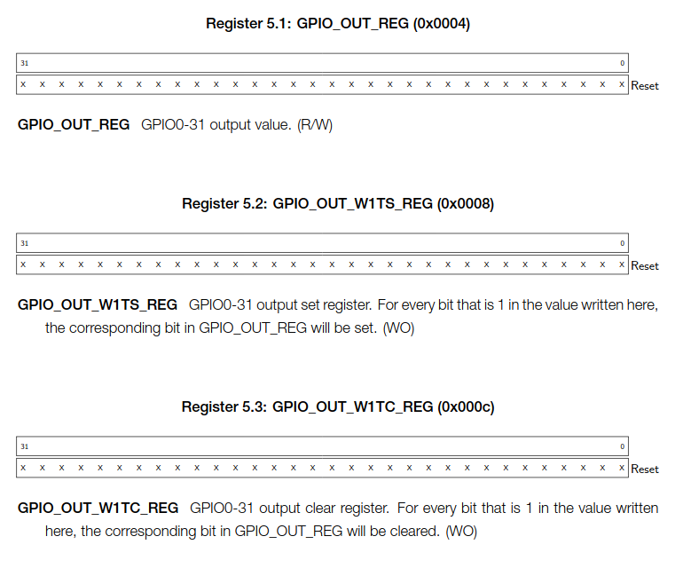
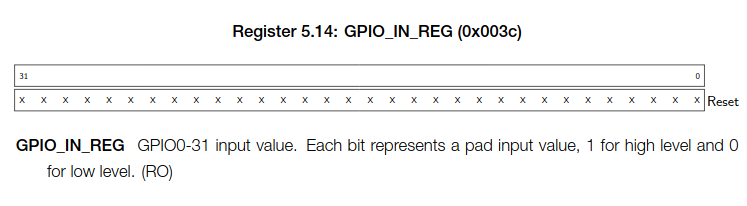

## Using GPIO registers to read/write from GPIOs

### Led blink using struct to access registers

Download esp-idf app from [here](../assets/week5/esp-gpio-example-output.zip). Unzip it and open the directory. Run `idf.py flash`.

```c
#include <stdio.h>
#include "freertos/FreeRTOS.h"
#include "freertos/task.h"
#include "driver/gpio.h"

void app_main(void)
{
    gpio_config_t io_conf;
    // bit mask for the pins, each bit maps to a GPIO 
    io_conf.pin_bit_mask = (1ULL<<2);

    // set gpio mode to input
    io_conf.mode = GPIO_MODE_OUTPUT;

    // enable pull up resistors
    io_conf.pull_up_en = 1;

    // disable pull down resistors
    io_conf.pull_down_en = 0;

    // disable gpio interrupts
    io_conf.intr_type = GPIO_INTR_DISABLE;

    // detailed description can be found at https://docs.espressif.com/projects/esp-idf/en/latest/esp32/api-reference/peripherals/gpio.html#_CPPv413gpio_config_t

    // configure gpio's according to the setting specified in the gpio struct
    esp_err_t err = gpio_config(&io_conf);

    static volatile gpio_dev_t *__gpio_reg = (void*)0x3FF44000;
    
    while(1)
    {
        __gpio_reg->out_w1ts = (1 << 2);
        vTaskDelay(1000/portTICK_PERIOD_MS);
 
        __gpio_reg->out_w1tc = (1 << 2);
        vTaskDelay(1000/portTICK_PERIOD_MS);
    }
}
```

So, we set struct to address 0x3FF44000 and made it volatile variable as it's value can change anytime due to external factors. Since we want to Blink led connected on Pin 2 onboard LED, we will set bit-2 as 1, so `1 << 2`, and do this to w1ts to set HIGH to gpio and do this to w1tc to set LOW to gpio

### Button input using struct to access registers

Download esp-idf app [here](../assets/week5/esp-gpio-example-input.zip). Unzip it and open the directory. Run `idf.py flash`.

```c
#include <stdio.h>
#include "freertos/FreeRTOS.h"
#include "freertos/task.h"
#include "driver/gpio.h"
#include "esp_log.h"

void app_main(void)
{
    gpio_config_t io_conf;
    // bit mask for the pins, each bit maps to a GPIO 
    io_conf.pin_bit_mask = (1ULL<<0);

    // set gpio mode to input
    io_conf.mode = GPIO_MODE_INPUT;

    // enable pull up resistors
    io_conf.pull_up_en = 1;

    // disable pull down resistors
    io_conf.pull_down_en = 0;

    // disable gpio interrupts
    io_conf.intr_type = GPIO_INTR_DISABLE;

    // detailed description can be found at https://docs.espressif.com/projects/esp-idf/en/latest/esp32/api-reference/peripherals/gpio.html#_CPPv413gpio_config_t

    // configure gpio's according to the setting specified in the gpio struct
    esp_err_t err = gpio_config(&io_conf);

    static volatile gpio_dev_t *__gpio_reg = (void*)0x3FF44000;
    
    while(1)
    {
        int bit_value = __gpio_reg->in >> 0 & 0x1;
        
        ESP_LOGI("gpio","value: %d", bit_value);
        vTaskDelay(10/portTICK_PERIOD_MS);
    }
}
```

So, we set struct to address 0x3FF44000 and made it volatile variable as it's value can change anytime due to external factors. Since we want to read the value of gpio 0, which has the boot button connected to it, we won't need to left shift it, as bit 0 represents state of pin 0. We `and` it with `0x1`, such that we extract the value of the 0th bit, and display it.

### Led blink using direct memory access

Download esp-idf app [here](../assets/week5/esp-gpio-output-direct-memory-access.zip). Unzip it and open the directory. Run `idf.py flash`.

```c
#include <stdio.h>
#include "freertos/FreeRTOS.h"
#include "freertos/task.h"
#include "driver/gpio.h"
#include "esp_log.h"

void app_main(void)
{
    gpio_config_t io_conf;
    // bit mask for the pins, each bit maps to a GPIO 
    io_conf.pin_bit_mask = (1ULL<<2);

    // set gpio mode to input
    io_conf.mode = GPIO_MODE_OUTPUT;

    // enable pull up resistors
    io_conf.pull_up_en = 1;

    // disable pull down resistors
    io_conf.pull_down_en = 0;

    // disable gpio interrupts
    io_conf.intr_type = GPIO_INTR_DISABLE;

    // detailed description can be found at https://docs.espressif.com/projects/esp-idf/en/latest/esp32/api-reference/peripherals/gpio.html#_CPPv413gpio_config_t

    // configure gpio's according to the setting specified in the gpio struct
    esp_err_t err = gpio_config(&io_conf);

    static volatile uint32_t *gpio_out_set_var = (void*)0x3FF44008;
    static volatile uint32_t *gpio_out_clear_var = (void*)0x3FF4400c;
    
    while(1)
    {
        *gpio_out_set_var = (1 << 2);
        vTaskDelay(1000/portTICK_PERIOD_MS);
 
        *gpio_out_clear_var = (1 << 2);
        vTaskDelay(1000/portTICK_PERIOD_MS);
    }
}
```

In this case we directly access the two 32-bit registers, by assigning their address to pointers, i.e. 0x3FF44008 for w1ts and 0x3FF4400c for w1tc register.We made it volatile variable as it's value can change anytime due to external factors. Since we want to Blink led connected on Pin 2 onboard LED, we will set bit-2 as 1, so `1 << 2`, and do this to w1ts to set HIGH to gpio and do this to w1tc to set LOW to gpio


### Button input using direct memory access

Download esp-idf app [here](../assets/week5/esp-gpio-input-direct-memory-access.zip). Unzip it and open the directory. Run `idf.py flash`.

```c
#include <stdio.h>
#include "freertos/FreeRTOS.h"
#include "freertos/task.h"
#include "driver/gpio.h"
#include "esp_log.h"

void app_main(void)
{
    gpio_config_t io_conf;
    // bit mask for the pins, each bit maps to a GPIO 
    io_conf.pin_bit_mask = (1ULL<<0);

    // set gpio mode to input
    io_conf.mode = GPIO_MODE_INPUT;

    // enable pull up resistors
    io_conf.pull_up_en = 1;

    // disable pull down resistors
    io_conf.pull_down_en = 0;

    // disable gpio interrupts
    io_conf.intr_type = GPIO_INTR_DISABLE;

    // detailed description can be found at https://docs.espressif.com/projects/esp-idf/en/latest/esp32/api-reference/peripherals/gpio.html#_CPPv413gpio_config_t

    // configure gpio's according to the setting specified in the gpio struct
    esp_err_t err = gpio_config(&io_conf);

    static volatile uint32_t *gpio_in_arr = (void*)0x3FF4403C;
    
    while(1)
    {
        int bit_value = *gpio_in_arr & 0x1;
        
        ESP_LOGI("gpio","value: %d", bit_value);
        vTaskDelay(10/portTICK_PERIOD_MS);
    }
}
```

In this case we directly access the 32-bit registers, by assigning their address to pointers, i.e. 0x3FF4403C for input register. We made it volatile variable as it's value can change anytime due to external factors. Since we want to read the value of gpio 0, which has the boot button connected to it, we won't need to left shift it, as bit 0 represents state of pin 0. We `and` it with `0x1`, such that we extract the value of the 0th bit, and display it.

# Assignment

- [Week 5 Assignment](https://github.com/SRA-VJTI/embedded-systems-study-group/blob/master/assets/week5/week%20_5_assignment.pdf)